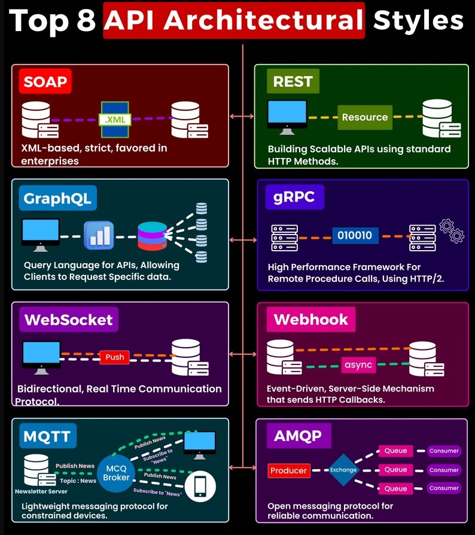

# __REAT_API__

### What is REST API?
REST stands for __REpresentational State Transfer__. It is an architectural style used for designing networked applications. REST is commonly used in web services development to create APIs (__Application Programming Interfaces__) that allow different systems to communicate with each other over HTTP. Restfull apis are designed around a set of principles to provide a standardized way of accessign and manipulating resources(data) over the web. These principles include:

__1. Resources__: In a RESTful API, resources are the fundamental entities that the API exposes. A resource can be anything from a user, a product, a blog post, or any other data entity. Each resource is identified by a unique URL called the "resource URI" or "endpoint."

<!-- 1. Statelessness: Each request from a client to a server should contain all the information necessary to understand and process the request.  -->

__2. HTTP Methods (Verbs)__: REST APIs use standard HTTP methods (also known as verbs) to perform operations on resources. The most commonly used HTTP methods in RESTful APIs are:

__GET__: Retrieve a representation of the resource.

__POST__: Create a new resource.

__PUT__: Update an existing resource or create one if it doesn't exist.

__DELETE__: Remove the resource.

__PATCH__: Update only a specific part of a resource rather than replacing the entire resource.

__COPY__: Copy a resource from one location to another. Widely used in RESTful APIs, but some systems might implement it for specific use cases.

__HEAD__: Similar to GET, but it only requests the headers of a resource, not the resource itself. Commonly used to check if a resource exists or to get information about the resource without downloading its content.

__OPTIONS__: The OPTIONS method is used to request information about the communication options available for a particular resource. It allows the client to determine the supported methods and other capabilities of the server.

__LINK__: The LINK method is not a standard HTTP method. It is possible that a specific API or framework might use it for linking resources, but it is not part of the standard HTTP methods.

__UNLINK__: Similar to LINK, UNLINK is not a standard HTTP method and might be used in specific APIs or systems for unlinking resources.

__PURGE__: PURGE is not a standard HTTP method and is not commonly used in RESTful APIs. It is possible that it might be used in some custom applications for specific purposes.

__LOCK__: The LOCK method is used to lock a resource for exclusive use by the client. It is typically used in WebDAV (Web-based Distributed Authoring and Versioning) systems to manage concurrent access to resources.

__UNLOCK__: The UNLOCK method is used to release a lock on a resource that was previously locked using the LOCK method in WebDAV systems.

__PROPFIND__: The PROPFIND method is used to retrieve properties of a resource. It is commonly used in WebDAV to request information about the properties of a resource.

__VIEW__: VIEW is not a standard HTTP method, and its usage might depend on the specific API or framework being used. It could be used for retrieving a particular view or representation of a resource.

__3. Stateless__: RESTful APIs are stateless, meaning each request from a client to the server must contain all the information necessary to understand and process the request. The server does not store any client state between requests. Each request should be self-contained, making the API scalable and easy to manage.

__4. Representations__: Resources in a RESTful API can have multiple representations, such as JSON, XML, HTML, or other formats. Clients can specify their preferred representation using the "Accept" header in the HTTP request.

__5. Uniform Interface__: A REST API should have a uniform interface to promote simplicity and consistency. It means that the same HTTP methods and status codes are used across different resources.

__6. Stateless Communication__: Client-server communication in a REST API is stateless, which means the server does not store any information about the client's state. Instead, each request from the client must contain all the information needed to understand and process the request.

__7. Versioning__: To support changes and updates to the API without breaking existing clients, versioning can be used. Versioning allows developers to introduce new features or make changes to the API while maintaining backward compatibility with older versions.

__8. Authentication and Authorization__: RESTful APIs can be secured using various authentication mechanisms like API keys, OAuth, or JSON Web Tokens (JWT). Authorization mechanisms can also be employed to control access to specific resources based on user roles and permissions.

REST APIs are widely used for building web services and enabling communication between different applications. They are popular due to their simplicity, scalability, and ease of integration with various programming languages and platforms. When designing and consuming REST APIs, adherence to the principles and best practices can lead to efficient and effective communication between clients and servers.

### Type to secure your API -
#### 1. __Authentication🕵🏻‍♀️__: Verifies the identity of users accessing APIs.
#### 2. __Authorization🚦__: Determines permissions of authenticated users.
#### 3. __Data Redaction✏️__: Observe sensitive data for protection.
#### 4. __Encryption🔒__: Encodes data so only authorized parties can decode it.
#### 5. __Error Handling❌__: Manages responses when things go wrong, avoiding revealing sensitive information.
#### 6. __Input Validation & Data Sanitization🧹__: Checks input data and removes harmful parts.
#### 7. __Intrusion Detection System👀__: Monitor networks for suspicious activities.
#### 8. __IP Whitelisting📝__: Permits API access only from trusted IP addressess.
#### 9. __Logging and Monitoring💻__: Keeps detailed loghs and regularly monitors APIs.
#### 10. __Rate Limiting⏱️__: Limits user request to prevent overload.
#### 11. __Secure Dependencies📦__: Ensures third-party code is free from vulnerabilities.
#### 12. __Secutity Headers🗒️__: Enhances site security against types of attacks like XSS.
#### 13. __Token Expiry⌛__: Regularly expiring ad renewing tokens prevents unauthorized access.
#### 14. __Use of Security Standards and Frameworks📕__: Guides your API security strategy.
#### 15. __Web Application Firewall🔥__:  Protects your site from HTTP-specific attacks.
#### 16. __API Versioning 🔁__: Maintains different versions of your API for seamless updates.
---

### Top 8 __API Architectural__ Styles -

__1. REST (REpresentational State Transfer):__ A champion of simplicity and ubiquity, REST is an architectural style that primarily leverages HTTP methods. It enables easy interaction with resources, making it a go-to pattern for a multitude of applications and modern APIs.

__2. SOAP (Simple Object Access Protocol):__ SOAP, a heavyweight contender in the API arena, thrives on complexity and power. It employs XML for defining structured communication. Although requiring a SOAP client and server, it compensates with its strength and robustness, much like a well-built off-road vehicle tackling rugged terrains.

__3. GraphQL:__ A rising star in the API cosmos, GraphQL offers flexibility and precision. It lets clients ask for exactly what they need, reducing redundancy, and improving performance. Think of it as a personal shopper - you get just what you asked for, nothing more, nothing less.

__4. gRPC (Google Remote Procedure Call):__ gRPC is the speedster of the API universe. Running on HTTP/2 and using binary data, it's all about performance and speed, especially for microservices architectures. It's like a high-speed train, ensuring quick and reliable communication.

__5. WebSockets:__ If real-time and bi-directional communication is what you need, WebSockets are the answer. Ideal for chat applications, live streaming, and real-time data exchange, it's like having an open telephone line between clients and servers.

__6. Webhooks:__ Webhooks are the town criers of the digital world. They notify clients when certain server-side events occur, making them perfect for event-driven architectures. Imagine them as your personal alert system, keeping you informed of what matters.

__7. MQTT (Message Queuing Telemetry Transport):__ MQTT is a lightweight messenger, designed specifically for environments with limited resources, low bandwidth, and unreliable networks. Picture it as a postal worker determined to deliver your mail, come rain or shine.

__8. AMQP (Advanced Message Queuing Protocol):__ A robust and standardized protocol, AMQP excels in middleware environments with its reliable messaging capabilities. It's like a well-oiled assembly line, efficiently moving messages where they need to go.

### Which API architectural style should you use?

The best API architectural style for a particular application will depend on the specific requirements of the application, such as  -

1. The type of data that will be exchanged between the API and the client
   
2. The performance requirements of the API
   
3. The security requirements of the API
   
4. The scalability requirements of the API

Once you have considered these factors, you can start to narrow down your choices and choose the API architectural style that is best suited for your application.

